# 提取图像显著性区域
实现的效果如下：
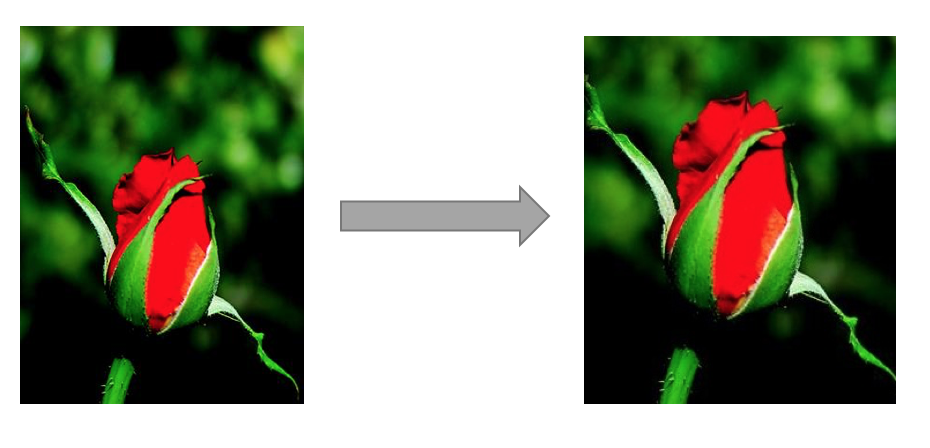  

## 一、图像显著性检测
这里使用的方法来自以下论文。   
[1] Zhu W, Liang S, Wei Y, et al. Saliency Optimization from Robust Background Detec- tion[C].//Computer Vision and Pattern Recognition. Columbus, OH, USA:IEEE, 2014:2814- 2821
### 1、介绍
  在显著性检测中，利用背景先验进行检测是一种有效的方式，即认为图像边界是背景或者可以容易地连接到图像边界的图像块是背景。这样的方法很容易引入前景噪声，且当物体只稍微接触到边界时也可能被判定为背景。
  文中提出了一个新颖而可靠的背景判定方法：边界连接度。文中提出的判定表明，仅当图像块所属的区域与图像边界紧密连接时，图像块才是背景。   
  这种方法描述了图像区域相对于图像边界的空间布局，且具有直观的几何解释，因此在图像内容变化方面是稳定的。   
### 2、边界连接度
#### （1）定义
  从下图可以观察到，在空间布局上，目标区域与图像边界的连接要比背景区域与图像边界的连接少得多。图像由四个区域组成，从人类的感知来看，绿色区域明显是一个显著目标，因为它更大、更紧凑，而且只略微接触到图像边界。蓝色和白色区域显然是背景，因为它们明显地接触到图像边界。粉红色区域只略微地接触到图像边界，但由于它的大小也很小，看起来更像是一个部分裁剪的对象，因此不是一个显著目标。   
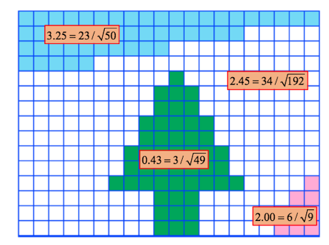   
  于是，文章提出了一种量化某个区域R与图像边界的连接程度的方法，称为边界连接度。它被定义为   
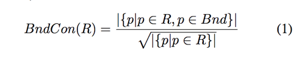    
   其中Bnd是图像边界块的集合，p是图像块。   
   边界连接度有直观的几何解释：它是区域R在边界上图像块的周长与区域R的总周长或者说是区域R面积的平方根之比（图上就是区域R在边界上图像块的块数与区域R的总块数的平方根之比）。这里使用面积的平方根来实现比例不变性：在不同的图像补丁分辨率下，该测量保持稳定。如上图，对于背景区域，边界连接度通常较大，而对于目标区域，边界连接度通常较小。   
   （之所以要取根号，我的理解为，如果图像分辨率不同，那么相应的图像块的面积大小也不同，这样可能会引起误差，比如图上的例子，3/49约等于0.06，34/192约等于0.18，这样看树的连接度低很多，但如果图像被放大了，他们的连接度差别将没那么明显，取根号可以有效防止图像放大带来的副作用。）   
#### （2）边界连接度公式计算
  公式（1）中的定义虽然直观，但难以计算。因为图像分割本身是一个具有挑战性且尚未解决的问题。使用硬分割不仅涉及到算法、参数选择的难题，而且还会沿区域边界引入不希望出现的不连续伪影。   
  文章指出，准确的硬图像分割是不必要的。文中提出了一种“软”方法，首先使用SLIC方法将图像抽象为一组组几乎规则的超像素块的集合。超级像素结果示例如下图（a）所示。   
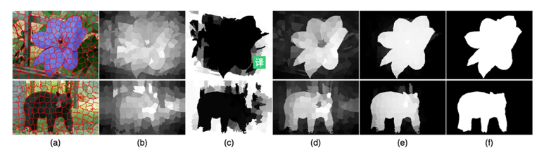    
  然后，连接所有相邻的超像素块，将它们之间的权重dapp指定为它们的平均颜色在CIE-Lab颜色空间中的欧几里德距离，来构造一个无向加权图。(CIE-Lab是CIE的一个颜色系统，表色体系，可用于确定某个颜色的数值信息。)   
  任意两个超像素块之间的测地线距离dgeo（p；q）定义为：在图上，两个超像素之间沿最短路径累积的权重dapp。（dgeo我理解为两个超像素块的颜色相似度或者说颜色相差度）。方便起见，定义dgeo（p；p）=0。（测地线，即曲面上两点间距离最短的线）   
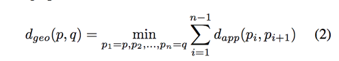    
  定义每个超级像素块p所属区域的面积为   
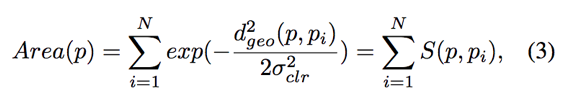    
  公式利用高斯权重函数将两个超像素块之间的距离（或者说相似度）映射到（0，1）之间，当两个超像素块更相似，则其映射的值更倾向于1。也就是，公式判断p与每一个pi的相似度，然后将每一个相似度相加，最后就是p所属区域的面积。   
  同样地，把p所属区域的触碰到图像边界的超像素块的长度定义为    
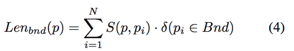   
  其中，超像素块若在图像边界上，为1，否则为0。    
  （这里的长度实际上也是面积，因为是像素块。这里的p应为图像块碰到边界的）    
  最后，以类似于式（1）来计算边界连接性    
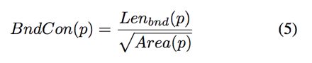   
### 3、背景加权对比度——使用边界连接度来改善对比度计算
  通常，传统的对比度计算为：某像素与所有其他像素的外观距离（即之前说过的相似度）乘以空间距离之和，即   
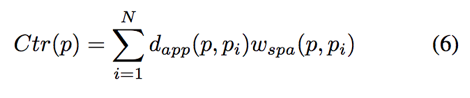    
  其中，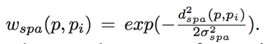。dspa（p,pi）是超像素块p和pi的中心之间的空间距离。   
	文章引入背景概率wbgi作为一个新的加权项来扩展式（6）。使用超像素块pi的边界连通度来值映射出概率wbgi。当边界连接性较大时，它接近于1；当边界连接性较小时，它接近于0。定义是   
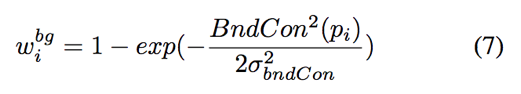     
  增强的对比度，称为背景加权对比度，定义为    
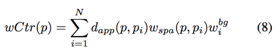   

### 4、结果对比
  文章将其他论文的算法与本文的算法进行对比，包括SF、MR、GS算法。   
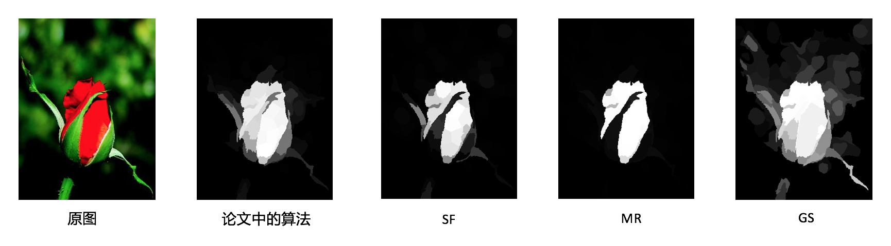 

以上，为论文中的显著性检测的算法。   
下载了论文的代码，发现它是MATLAB和CPP混编的，而且代码比较久远，其中有许多问题，我一个个debug，最后还是跑了起来，最后得到的结果。    
得到经过图像显著性检测的灰度图以后，需要进行图像二值化。 

### 5、关于论文的参考资料：  
https://blog.csdn.net/yxz3024/article/details/79913449    
https://blog.csdn.net/dayenglish/article/details/51275128#commentsedit    
https://www.cnblogs.com/ariel-dreamland/p/9282905.html    
https://blog.csdn.net/zhangwenjuan1995/article/details/95043177     

## 二、图像二值化
图像的二值化，就是将图像上的像素点的灰度值设置为0或255，使整个图像呈现出只有黑色和白色的视觉效果。我们可以通过设置一个阈值，判断图像的像素点的灰度值大于阈值还是小于阈值，从而判断将其设置为255还是0。那么这个阈值的设置就尤为重要。   

### 1、全局阈值（单阈值）
#### （1）最简单的方法
原理：将阈值设置为127，如果像素点的灰度值小于127，则将其灰度值设置为0，如果像素点的灰度值大于127，则将其灰度值设置为255。   
优点：简单，计算量少速度快。   
缺点：首先阈值为127没有任何理由可以解释，其次完全不考虑图像的像素分布情况与像素值特征，可能导致部分对象像素或者背景像素丢失。   
改进：可将阈值改为所有像素点的灰度值的平均值。   

#### （2）双峰法
原理：把图像看作由前景和背景组成，在灰度直方图上，前景和背景都形成一个高峰，在双峰之间的最低谷处就是图像的阈值所在。假如一张图像的直方图如下所示：
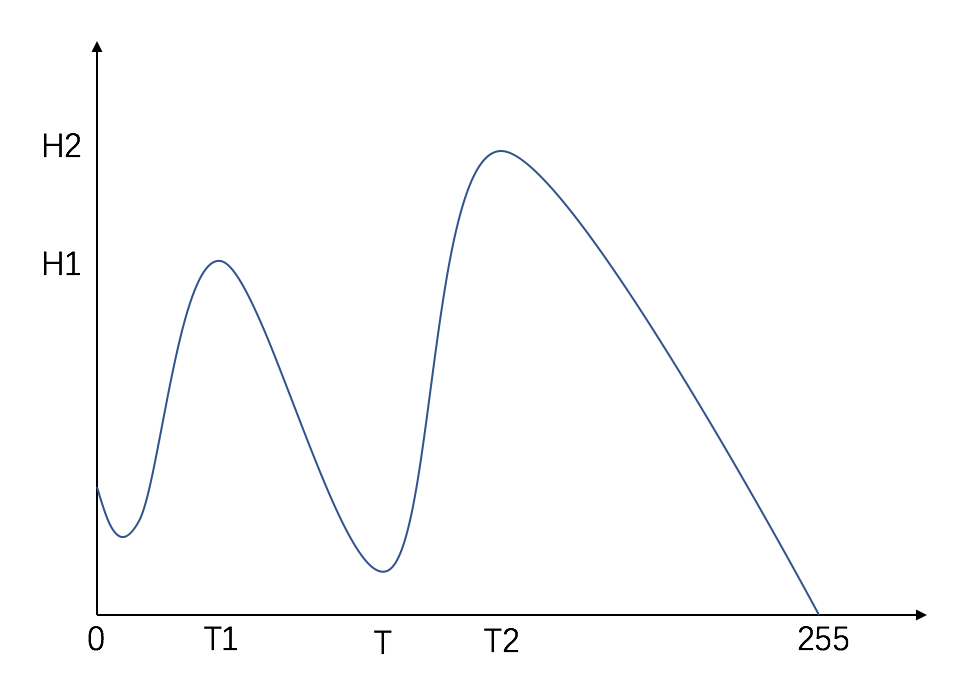     
从图中我们可以看到有两个顶峰，将顶峰记为H1和H2，他们对应的灰度值分别为T1和T2，那么双峰法的思想就是要找到图像两个顶峰之间的最低值作为阈值。简单来说就是，在一张图像中，灰度值为T1和T2的像素点是最多的，在[T1,T2]的灰度值范围之间，像素点最少的灰度值，就是阈值。    
优点：该方法适用于直方图有两个顶峰的图像，即背景与前景颜色差别较大的图像。    
缺点：不适合直方图曲线平坦或者只有一个顶峰的图像。    

#### （3）迭代法
原理：首先初始化一个阈值T0，然后按照某种策略通过迭代不断更新这一阈值，直到满足给定的约束条件为止。通过迭代方法选择阈值的计算方法如下：    
（1）选择图像所有像素点的灰度值的平均值作为初始阈值T0。    
（2）对于灰度值小于等于T0的像素点，计算出他们的灰度值的平均值T1；对于灰度值大于T0的像素点，计算出他们的灰度值的平均值T2。    
（3）新的阈值为T=（T1+T2）/2。    
（4）比较T和T0，若相等，则返回T，T即为迭代法得到的阈值; 否则设T0=T，重复步骤（1）~（3），直至T和T0相等。   
优点：用迭代法所获得的阈值进行二值化的图象效果良好，因为基于迭代的阈值能区分出图像的前景和背景的主要区域所在。   
缺点：但在图像的细微处（即图像的浅色线条）还没有很好的区分度。而对于某些特定图象，微小数据的变化却会引起分割效果的巨大改变。   

#### （4）otsu法（最大类间方差法/大律法）
原理：用阈值将原图像分成前景、背景两类，当取最佳阈值时，背景应该与前景差别最大，在otsu算法中衡量差别的标准就是最大类间方差。基本思想是，从0到255循环选取灰度t作为阈值，根据阈值把图像分为两类，然后计算两类之间的方差，使类间方差达到最大时的阈值，即为所求最佳阈值。
otsu的公式推导：记t为前景与背景的分割阈值，前景点数占图像比例为w0，平均灰度为u0；背景点数占图像比例为w1，平均灰度为u1。   
则图像的总平均灰度为：u=w0\*u0+w1\*u1。   
前景和背景图象的方差：g=w0\*(u0-u)\*(u0-u)+w1\*(u1-u)\*(u1-u)=w0\*w1\*(u0-u1)\*(u0-u1),此公式为方差公式。    
当方差g最大时，可以认为此时前景和背景差异最大，此时选取的灰度t是最佳阈值。    
优点：类间方差法对噪音和目标大小十分敏感，它仅对类间方差为单峰的图像产生较好的分割效果。     
缺点：当目标与背景的大小比例悬殊时（例如受光照不均、反光或背景复杂等因素影响），类间方差准则函数可能呈现双峰或多峰，此时效果不好，但是类间方差法是用时最少的。    

### 2、自适应阈值（多阈值）
上面所有选取阈值的方法，都是对图像上的每个像素使用相等的阈值。
但在实际情况中，当照明不均匀、有突发噪声或者背景变化较大时，对于整幅图像将没有合适的单一阈值，如果仍采用单一的阈值去处理每一个像素，可能会将目标和背景区域错误划分。    
而自适应阈值，就是将图像中的每个像素设置可能不一样的阈值，根据像素的邻域块的像素值分布来确定该像素位置上的阈值。   
基本原理：规定一个区域大小，对每个像素确定以其自身为中心的一个区域（即其邻域），计算区域内所有像素值的平均值（或者区域内最大和最小像素值的平均值，或者区域内内所有像素值的高斯卷积），将其作为该像素点的阈值。   
优点：每个像素的阈值不是都一样的，而是由其周围邻域像素的分布来决定的。亮度较高的图像区域的阈值通常会较高，而亮度较低的图像区域的阈值则会相适应地变小。   
缺点：计算较为复杂。   

### 3、几种方法的效果
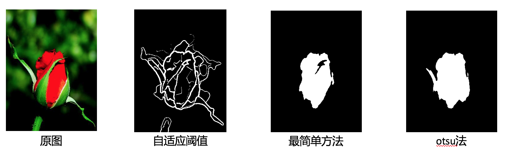  

### 4、关于图像二值化的参考资料：
https://blog.csdn.net/u011600592/article/details/75044250   
https://baike.baidu.com/item/otsu/16252828   
https://blog.csdn.net/weixin_34163553/article/details/85991870    
https://blog.csdn.net/qq_44262417/article/details/89283484     
https://blog.csdn.net/wrightman/article/details/39204265    
https://blog.csdn.net/zhu_hongji/article/details/80967776    
https://blog.csdn.net/u014737138/article/details/80379309   
https://blog.csdn.net/whl970831/article/details/99706730    
https://blog.csdn.net/fly108108/article/details/81104330#4%E3%80%81%C2%A0%E8%BF%AD%E4%BB%A3%E9%98%88%E5%80%BC%E5%88%86%E5%89%B2   
https://blog.csdn.net/cp32212116/article/details/44487913   
https://blog.csdn.net/bravebean/article/details/51374066 

## 三、根据二值化后的图像得到显著性区域的包围矩形及其坐标
使用cv2.boundingRect()方法即可。   
结果：   
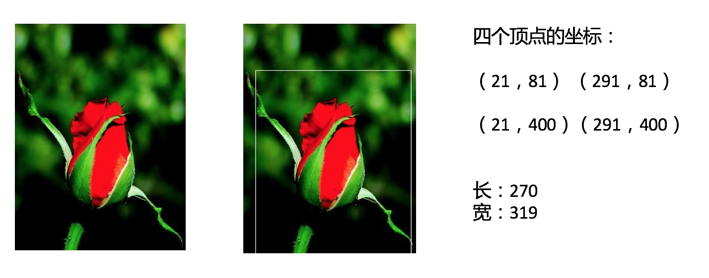      
资料：   
https://www.cnblogs.com/mrfri/p/8550328.html   

## 四、裁剪图像得到原图像的显著性区域
根据获得的包围矩形坐标，利用矩形的索引即可。
结果：   
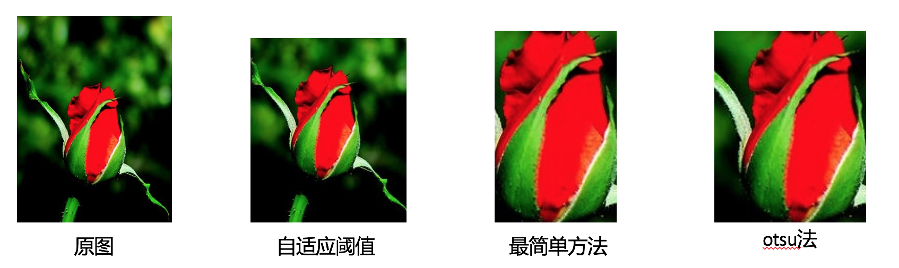     

