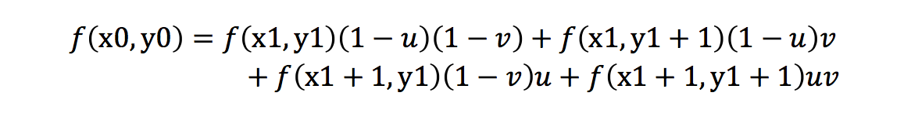
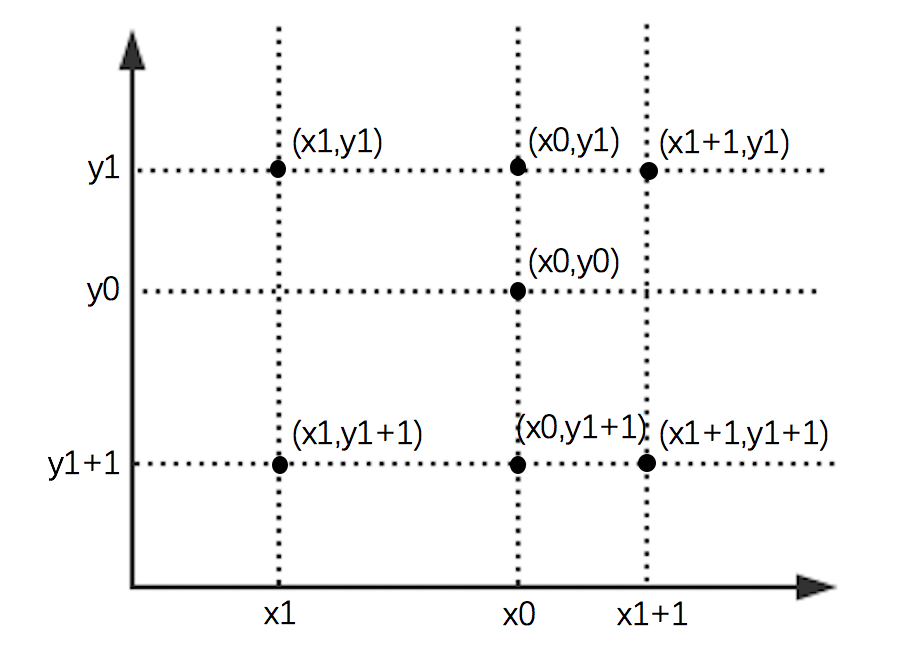
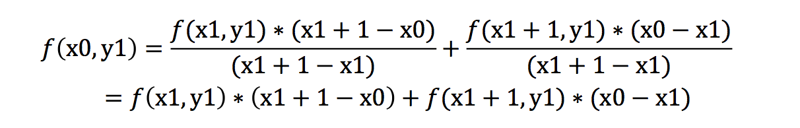
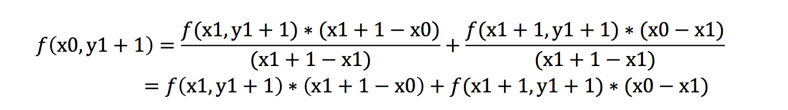
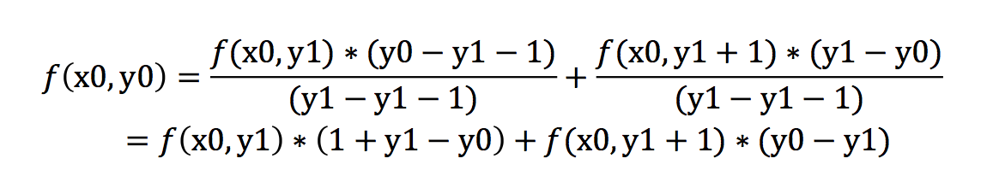
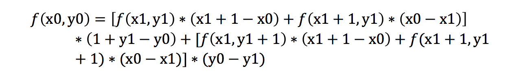

# 图像放缩——使用双线性插值
## 一、运行
```
$ python scaling.py
```
注意：需要下载pillow和numpy，代码在scaling.py文件。ScalingResult文件夹为部分运行结果。

## 二、双线性插值
### 1. 线性插值   
### 2. 双线性插值   
（1）原理   
首先，假设原图像A的尺寸为m*n，缩放后后的图像B的尺寸为a*b，即缩放的倍数k=a/m=b/n。那么可以知道对于图像B中的一点(i,j)，对应在图像A中的理论位置为(i*m/a,j*n/b)，将此理论位置标记为(x0,y0)。但这样得出来的在A中的理论位置数值可能为小数，因此，我们找到离理论位置最近的四个点，根据这四个点的值，使用双线性插值的数学公式，计算点(i,j)的值。   
（2）步骤   
首先，记图像A的尺寸为input_width*input_height，图像B的尺寸为output_width*ouput_height。   
遍历图像B中的像素点，记某点为(i,j)，计算该点在A中的理论位置(x0,y0）：   
```
x0 = i / output_height * input_height
y0 = j / output_width * input_width
```
接着，找到离点(x0,y0)最近的四个点。记左上角的点为（x1,y1)，即：   
```
x1 = [x0]  #对y0取整
y1 = [y0]  #对x0取整
```
那么剩下的三个点为(x1+1,y1)、(x1,y1+1)、(x1+1，y1+1)。   
在进行图像放大时，会发生越界，因此还需要防止越界。   
```
if (x1+1) >= input_height:
    x1 = input_height - 1 - 1
if (y1+1) >= input_width:
    y1 = input_width - 1 - 1
```
最后，根据双线性插值的公式，计算出点(i,j)的值g(i,j)，g(i,j)的值即f(x0,y0)的值。公式如下：   

由于公式的推导过程比较复杂，在此不赘述，在后面的第（3）点简要补充说明。   
其中，u为x0的小数部分，v为y0的小数部分，即：   
```
u=x0-x1   
v=y0-y1   
```
### 3. 双线性插值的公式推导   
在找到离点(x0,y0)最近的四个点后，他们在图像中的位置如下图所示。   
   
设点(x0,y0)的值为f(x0,y0)。双线性插值的概念，即在x轴和y轴方向分别作一次线性插值。据此，先在x轴方向进行线性插值，得到：   


然后根据点(x0,y1)和点(x0,y1+1)在y轴方向上进行插值，得到：   

展开得公式得：    

最后，设x0-x1=u,y0-y1=v,化简公式得：    

